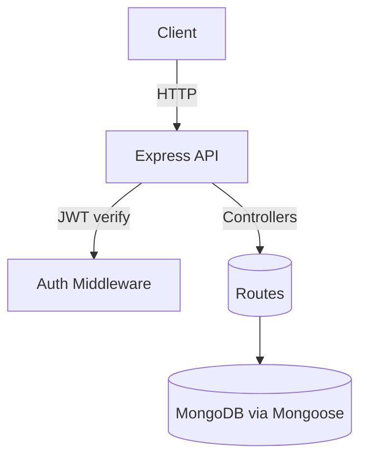

## Architecture

### High-Level

Express API with JWT auth, MongoDB via Mongoose, modular controllers/routes.

### Data Models

- User: `{ name, email(unique), password, timestamps }`
- Project: `{ title, description?, tasks[Task], members[User], createdBy(User), timestamps }`
- Task: `{ title, description?, priority(enum), dueDate?, assignedTo[User], status(enum), project(Project), timestamps }`

### API Endpoints

- Auth: `/api/auth/register`, `/api/auth/login`, `/api/auth/profile (GET/PUT)`
- Projects: `/api/project (POST,GET)`, `/api/project/:id (PUT,DELETE)`, `/api/project/users-projects/:id`
- Tasks: `/api/task/:id (GET project tasks)`, `/api/task (GET by title,id)`, `/api/task (POST)`, `/api/task/:id (PUT)`, `/api/task/status/:id (PUT)`, `/api/task/:id (DELETE)`

See `docs/openapi.yaml` for schemas and examples.

### State Management Rationale

- Stateless server with JWT; user identity comes from `Authorization: Bearer <token>`.
- MongoDB stores persistent state; responses include only what clients need.

### Error Handling Approach

- Validate IDs with `mongoose.Types.ObjectId.isValid`.
- Consistent JSON errors: `{ message, error? }` with appropriate HTTP codes (400,401,404,500).
- Controllers guard required fields and existence of related resources before writes.
